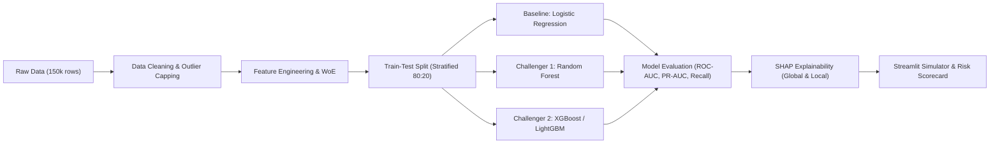
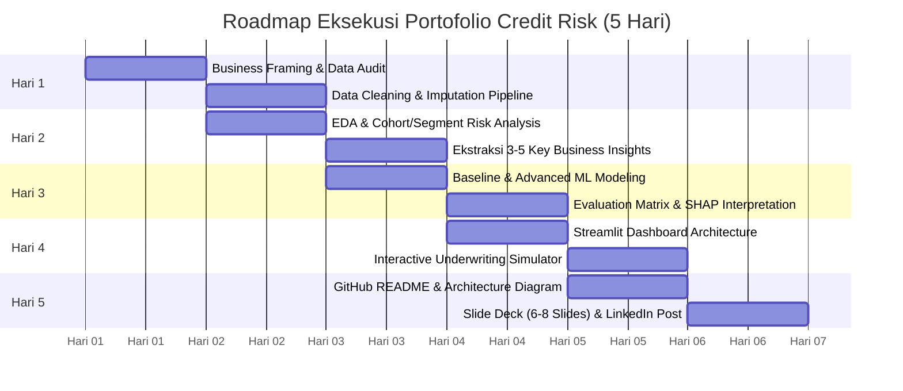

# 📊 Project Blueprint & Dataset Analysis Report: Credit Risk Scoring & Delinquency Prediction

> **Project Name Suggestion**: `CreditRiskAI: End-to-End Default Prediction & Interactive Risk Underwriting Simulator`  
> **Target Audience**: Data Science & Risk Analytics Recruiters, Hiring Managers (LinkedIn & GitHub Portfolio)  
> **Dataset**: Kaggle *Give Me Some Credit* Benchmark Dataset  
> **Status**: Planning & Audit Phase (Pre-execution)

---

## 1. Executive Summary & Ringkasan Proyek

Proyek ini dirancang sebagai **portofolio data science *end-to-end* tingkat industri (production-grade portfolio)** yang mendemonstrasikan kapabilitas dalam:
1. **Domain Understanding Perbankan/Fintech**: Memahami risiko kredit, *credit scoring*, dan trade-off finansial antara *Loss Due to Default* vs *Opportunity Loss*.
2. **Data Wrangling & Kualitas Data**: Menangani *missing values*, anomali kode biro kredit, serta pencilan (*outliers*) secara metodologis.
3. **Machine Learning pada Data Imbalanced**: Membangun model *baseline* (Logistic Regression) vs model *ensemble* (Random Forest / XGBoost) dengan evaluasi metrik non-akurasi (ROC-AUC, PR-AUC, Recall, KS-Statistic).
4. **Model Explainability (XAI)**: Menerapkan **SHAP** (*SHapley Additive exPlanations*) untuk kepatuhan regulasi kredit (*adverse action notices* / *fair lending*).
5. **Deployment & Interaktivitas**: Menghadirkan aplikasi interaktif berbasis **Streamlit** untuk simulasi skor risiko calon debitur bagi komite kredit.
6. **Executive Communication**: Menghasilkan *executive pitch deck* (6–8 slide) dan dokumentasi GitHub / LinkedIn yang memikat *hiring manager*.

---

## 2. Audit & Analisis Mendalam Isi Dataset (`datasets/`)

Terdapat 4 file utama dalam direktori `datasets/`:

| Nama File | Ukuran File | Dimensi Data (Baris × Kolom) | Keterangan & Peran |
| :--- | :---: | :---: | :--- |
| `cs-training.csv` | ~7.56 MB | 150,000 × 12 (1 index + 11 fitur) | Dataset historis berlabel untuk eksplorasi, *feature engineering*, dan pelatihan model. |
| `cs-test.csv` | ~4.98 MB | 101,503 × 12 (1 index + 11 fitur) | Dataset inferensi (target `SeriousDlqin2yrs` 100% NaN) untuk simulasi scoring data baru. |
| `Data Dictionary.xls`| ~14.8 KB | 11 definisi fitur | Dokumentasi resmi kamus variabel dari kompetisi kredit. |
| `sampleEntry.csv` | ~1.91 MB | 101,503 × 2 (`Id`, `Probability`) | Format standar skor probabilitas default untuk inferensi batch. |

---

### 2.1 Kamus Data & Deskripsi Variabel

Berdasarkan pembacaan `Data Dictionary.xls` dan inspeksi `cs-training.csv`:

| Nama Kolom | Tipe Data | Deskripsi Bisnis | Nilai Ekstrem / Catatan Audit |
| :--- | :---: | :--- | :--- |
| **`SeriousDlqin2yrs`** *(Target)* | Integer (0/1) | Mengalami gagal bayar (tunggakan 90+ hari) dalam kurun waktu 2 tahun ke depan. | **Imbalanced**: 6.68% Default (1), 93.32% Non-Default (0). |
| **`RevolvingUtilizationOfUnsecuredLines`** | Float | Rasio total saldo kartu kredit & kredit tanpa agunan dibagi total limit kredit yang tersedia. | Median: 0.154, Q3: 0.559. Nilai maks mencapai **50,708** (3,321 baris bernilai > 1.0; memerlukan *winsorization/capping*). |
| **`age`** | Integer | Usia peminjam dalam tahun. | Rentang 0 s.d. 109 tahun. Ditemukan **1 baris dengan umur = 0** (harus di-clean/diimputasi). |
| **`NumberOfTime30-59DaysPastDueNotWorse`**| Integer | Frekuensi peminjam terlambat bayar 30–59 hari dalam 2 tahun terakhir. | Terdapat **269 baris bernilai 96 atau 98** (kode khusus biro kredit untuk data *unreported/unknown*). |
| **`DebtRatio`** | Float | Pengeluaran cicilan bulanan & biaya hidup dibagi total pendapatan kotor bulanan (*Debt Service Ratio*). | Median: 0.366. Nilai maks mencapai **329,664** (karena pendapatan 0 atau hilang, sistem mencatat nominal pengeluaran absolut). |
| **`MonthlyIncome`** | Float | Pendapatan kotor bulanan peminjam (USD). | **29,731 baris kosong (19.82%)**. Median: $5,400, Mean: $6,670, Maks: $3,008,750. |
| **`NumberOfOpenCreditLinesAndLoans`** | Integer | Jumlah pinjaman aktif (KPR, pinjaman mobil, kartu kredit). | Median: 8, Maks: 58 pinjaman aktif. |
| **`NumberOfTimes90DaysLate`** | Integer | Frekuensi keterlambatan fatal (≥ 90 hari). Merupakan prediktor paling berkorelasi kuat dengan default. | Terdapat **269 baris bernilai 96 atau 98** (kode khusus biro kredit). |
| **`NumberRealEstateLoansOrLines`** | Integer | Jumlah pinjaman agunan properti / KPR (*Mortgage* & *Home Equity Lines*). | Median: 1, 62.5% memiliki ≥ 1 properti, Maks: 54. |
| **`NumberOfTime60-89DaysPastDueNotWorse`**| Integer | Frekuensi keterlambatan moderat (60–89 hari) dalam 2 tahun terakhir. | Terdapat **269 baris bernilai 96 atau 98** (kode khusus biro kredit). |
| **`NumberOfDependents`** | Float | Jumlah tanggungan keluarga (di luar peminjam). | **3,924 baris kosong (2.62%)**. Median: 0, Maks: 20 tanggungan. |

> **Catatan Penting mengenai "Tujuan Pinjaman" (Loan Purpose)**:  
> Dataset *Give Me Some Credit* tidak memiliki kolom teks kategorikal bernama *Loan Purpose* (seperti pada LendingClub). Namun, diversifikasi produk pinjaman direpresentasikan secara jelas oleh:
> - `NumberRealEstateLoansOrLines` (Kredit beragun properti / KPR)
> - `NumberOfOpenCreditLinesAndLoans` (Kredit konsumtif / kartu kredit / pinjaman tanpa agunan)  
> *Solusi Rekayasa Fitur*: Kita akan membuat variabel segmen proksi bernama **`ProductMix_Category`** (contoh: *Mortgage Only*, *Unsecured Credit Only*, *Mixed Portfolio*, *No Active Lines*) untuk memenuhi analisis tingkat risiko berdasarkan profil fasilitas pinjaman.

---

### 2.2 Temuan Kunci Kualitas Data (*Data Quality Findings*)

```
[Distribusi Target SeriousDlqin2yrs]
Total Debitur   : 150,000 nasabah
Non-Default (0) : 139,974 nasabah (93.32%)
Default (1)     :  10,026 nasabah ( 6.68%)
Imbalance Ratio : ~ 14 : 1
```

1. **Class Imbalance yang Signifikan**:
   - Hanya 6.68% nasabah yang mengalami gagal bayar. Model naif yang memprediksi semua nasabah "lancar" akan memperoleh akurasi 93.32%, namun gagal total dalam mendeteksi nasabah berisiko. Oleh karena itu, metrik utama wajib menggunakan **ROC-AUC**, **PR-AUC**, **Recall**, dan **F1-Score**.
2. **Missing Values**:
   - `MonthlyIncome`: **19.82% missing** (29,731 data). Tidak boleh sekadar di-*drop* karena akan menghilangkan 1/5 data berharga. Kita akan menguji strategi imputasi median per kelompok usia/pendidikan atau menggunakan model-based imputation (IterativeImputer/KNN/XGBoost native missing handling).
   - `NumberOfDependents`: **2.62% missing** (3,924 data). Dapat diimputasi dengan modus/median (nilai 0).
3. **Anomali Nilai 96 & 98 pada Riwayat Keterlambatan**:
   - Terdapat 269 baris yang secara bersamaan memiliki nilai 96 atau 98 pada `NumberOfTime30-59DaysPastDueNotWorse`, `NumberOfTime60-89DaysPastDueNotWorse`, dan `NumberOfTimes90DaysLate`. Nilai ini bukan jumlah keterlambatan sebenarnya, melainkan *bureau error/unreported code*. Kita perlu memetakan dan menangani nilai ini (misalnya dengan perlakuan khusus atau *flag indicator*).
4. **Anomali Nilai Ekstrem (Outliers)**:
   - `age = 0` (1 baris): Harus diubah menjadi *missing* dan diimputasi median.
   - `RevolvingUtilizationOfUnsecuredLines > 10` (241 baris) hingga 50,708: Perlu dilakukan teknik *winsorization* (pembatasan di persentil ke-99 atau batas 2.0).
   - `DebtRatio` ribuan kali lipat: Terjadi ketika `MonthlyIncome` bernilai 0 atau tidak terisi. Perlu dibuatkan fitur interaksi / *indicator missing income*.

---

## 3. Analisis Segmen Risiko Awal (*Empirical Risk Insights*)

Berdasarkan pengujian statistik langsung terhadap dataset pelatihan:

### 3.1 Segmentasi Berdasarkan Kelompok Usia (*Age Brackets*)
| Kelompok Usia | Jumlah Nasabah | Nasabah Default | Tingkat Default (*Default Rate*) | Indeks Risiko Relatif |
| :--- | :---: | :---: | :---: | :---: |
| **< 30 Tahun (Gen Z / Dewasa Muda)** | 10,757 | 1,244 | **11.56%** | **1.73x (Sangat Tinggi)** |
| **30 – 44 Tahun (Usia Produktif Awal)** | 40,547 | 3,775 | **9.31%** | **1.39x (Tinggi)** |
| **45 – 59 Tahun (Usia Mapan)** | 53,635 | 3,657 | **6.82%** | **1.02x (Rata-rata)** |
| **≥ 60 Tahun (Pensiun / Senior)** | 45,060 | 1,350 | **3.00%** | **0.45x (Sangat Rendah)** |

*Insight*: Nasabah di bawah usia 30 tahun memiliki risiko gagal bayar hampir **4 kali lipat** dibandingkan nasabah senior (≥ 60 tahun). Faktor kematangan finansial dan akumulasi aset sangat berpengaruh.

---

### 3.2 Segmentasi Berdasarkan Tingkat Pendapatan (*Income Quartiles*)
| Kuartil Pendapatan | Rentang Pendapatan Bulanan | Jumlah Nasabah | Tingkat Default (*Default Rate*) |
| :--- | :--- | :---: | :---: |
| **Q1 (Rendah)** | ≤ $3,400 | 30,289 | **9.21%** |
| **Q2 (Menengah-Bawah)** | $3,401 – $5,400 | 30,026 | **7.87%** |
| **Q3 (Menengah-Atas)** | $5,401 – $8,249 | 29,895 | **6.07%** |
| **Q4 (Tinggi)** | > $8,249 | 30,059 | **4.62%** |

*Insight*: Terdapat korelasi negatif yang konsisten antara pendapatan dan risiko default. Nasabah pada kuartil terendah memiliki risiko default **2 kali lipat** dibandingkan kuartil tertinggi.

---

### 3.3 Segmentasi Berdasarkan Kepemilikan Agunan Properti (*Mortgage Ownership*)
| Kategori Portofolio Pinjaman | Jumlah Nasabah | Tingkat Default (*Default Rate*) | Interpretasi Risiko |
| :--- | :---: | :---: | :--- |
| **Tanpa KPR / Pinjaman Properti** (`RealEstate = 0`) | 56,188 | **8.31%** | Lebih tinggi; didominasi kredit tanpa agunan. |
| **Memiliki KPR / Pinjaman Properti** (`RealEstate ≥ 1`) | 93,812 | **5.71%** | Lebih rendah 31%; debitur KPR melewati *screening* kredit bank yang lebih ketat. |

---

## 4. Metodologi Modeling, Evaluasi, & Interpretasi



### 4.1 Pemilihan Model
1. **Baseline Model: Logistic Regression**
   - Standar industri perbankan (*Scorecard Modeling*).
   - Mudah diinterpretasikan, linier terhadap *log-odds*, dan menjadi pembanding wajib sebelum menggunakan model kompleks.
2. **Challenger Model 1: Random Forest**
   - Menangkap interaksi non-linier antar fitur tanpa memerlukan asumsi distribusi.
3. **Challenger Model 2: XGBoost / LightGBM**
   - Algoritma *state-of-the-art* untuk data tabular terstruktur.
   - Efisien dalam menangani *missing values* dan data *imbalanced* menggunakan parameter `scale_pos_weight`.

### 4.2 Strategi Penanganan Imbalanced Data
- **Algorithmic Weighting**: Menggunakan parameter `class_weight='balanced'` pada Logistic Regression / Random Forest, dan `scale_pos_weight = 13.9` pada XGBoost.
- **Threshold Moving**: Menentukan ambang batas keputusan (*cut-off threshold*) probabilitas berdasarkan analisis kurva presisi-recall dan *cost-benefit analysis* perbankan (tidak kaku di 0.50).

### 4.3 Matriks Evaluasi
- **ROC-AUC (Receiver Operating Characteristic - Area Under Curve)**: Mengukur kemampuan diskriminasi model dalam membedakan debitur baik vs debitur macet pada seluruh *threshold* (Target benchmark: > 0.85).
- **PR-AUC (Precision-Recall AUC)**: Metrik paling sensitif untuk kelas minoritas pada data sangat timpang.
- **Recall pada Top Decile**: Mengukur persentase debitur macet yang berhasil dijaring pada 10% nasabah dengan skor risiko tertinggi.
- **KS-Statistic (Kolmogorov-Smirnov)**: Metrik standar industri perbankan untuk mengukur jarak pemisahan maksimal antara distribusi kumulatif *good* dan *bad borrowers*.

### 4.4 Model Explainability dengan SHAP
- **SHAP Summary Plot (Beeswarm)**: Mengetahui fitur mana yang secara global paling mendorong atau menekan risiko kredit.
- **SHAP Force / Waterfall Plot**: Menjelaskan alasan spesifik mengapa aplikasi kredit seorang nasabah tertentu disetujui atau ditolak (relevan untuk regulasi *Right to Explanation* / *Fair Lending*).

---

## 5. Rencana Deliverables Portofolio

Untuk memastikan portofolio ini tampil memukau di LinkedIn dan GitHub, proyek ini akan menghasilkan 4 output utama:

### 📱 Deliverable 1: Interactive Streamlit Dashboard (`app.py`)
- **Fitur 1 - Individual Credit Risk Simulator**:
  - Formulir interaktif (input umur, pendapatan, penggunaan limit kartu kredit, riwayat tunggakan, jumlah pinjaman).
  - Output visual: *Gauge chart* probabilitas default (0% - 100%), Credit Score (300 - 850 skala FICO), dan Keputusan Otomatis (*Approved*, *Manual Review*, *Rejected*).
  - *Local SHAP explanation*: Waterfall chart interaktif yang menampilkan faktor penentu keputusan spesifik nasabah tersebut.
- **Fitur 2 - Portfolio Risk Analytics**:
  - Visualisasi distribusi risiko portofolio, analisis sensitivitas *threshold*, dan simulasi kerugian finansial (*Expected Loss*).

### 📓 Deliverable 2: Production-Grade Jupyter Notebook
- Kode modular, bersih, terdokumentasi rapi dengan narasi bisnis di setiap *cell markdown*.
- Visualisasi estetis menggunakan palet warna korporat/fintech modern (*Matplotlib/Seaborn/Plotly*).

### 📑 Deliverable 3: Executive Pitch Deck (6–8 Slide)
Dirancang siap diekspor menjadi PDF atau format Carousel LinkedIn:
- **Slide 1**: Cover & Project Overview (*Credit Risk AI: Mitigating NPL with Explainable ML*).
- **Slide 2**: The Business Problem (Dilema Bank: Menolak nasabah baik vs Mengizinkan kredit macet).
- **Slide 3**: Data Landscape & Segmen Risiko Utama (Usia, Pendapatan, Debt Ratio).
- **Slide 4**: Engineering & Modeling Strategy (Baseline vs XGBoost).
- **Slide 5**: Model Performance & Trade-off Matrix (ROC-AUC, PR-AUC, Cost Matrix).
- **Slide 6**: Explainable AI dengan SHAP (Transparansi regulasi dan alasan penolakan kredit).
- **Slide 7**: Interactive Risk Simulator Tool (Demo aplikasi Streamlit).
- **Slide 8**: Business Impact & Rekomendasi Kebijakan Kredit Perbankan.

### 🌐 Deliverable 4: GitHub Repository & LinkedIn Showcase Pack
- `README.md` berstandar tinggi: Badges, *problem statement*, arsitektur alur kerja, tabel perbandingan model, screenshot Streamlit, dan panduan instalasi.
- Naskah postingan LinkedIn dengan formula *Storytelling + Hard Metrics + Carousel Deck + Video Demo*.

---

## 6. Rencana Timeline & Roadmap Eksekusi 5 Hari



### 🗓️ Hari 1: Pendefinisian Masalah Bisnis & Data Cleaning Pipeline
- **Aktivitas**:
  - Merumuskan *objective function* bisnis: Minimalkan *Non-Performing Loans* (NPL) tanpa mencekik laju persetujuan kredit (*Approval Rate*).
  - Mengatasi *missing values* pada `MonthlyIncome` (19.82%) dan `NumberOfDependents` (2.62%) dengan metode imputasi yang tepat.
  - Membersihkan *outlier* dan kode biro kredit: Mengatasi nilai 96 & 98 pada kolom keterlambatan, nilai `age = 0`, serta pembatasan rasio `RevolvingUtilizationOfUnsecuredLines`.
  - Membuat *modular data preprocessing pipeline* yang dapat digunakan berulang (*reusable* untuk data train dan test).
- **Deliverable Hari 1**: Skrip/Notebook pembersihan data yang bersih dan dataset siap olah (*clean data*).

### 🗓️ Hari 2: EDA, Segmentasi Risiko, & 3–5 Insight Bisnis Utama
- **Aktivitas**:
  - Melakukan analisis univariat dan bivariat terhadap semua fitur prediktor.
  - Menganalisis tingkat gagal bayar per segmen:
    1. *Segmen Usia* (Young Borrowers vs Middle Age vs Seniors).
    2. *Segmen Pendapatan & Rasio Utang* (Low Income High DTI vs High Income Low DTI).
    3. *Segmen Portofolio Kredit* (Pemilik KPR vs Kredit Konsumtif Tanpa Agunan).
  - Merumuskan 3–5 temuan strategis yang ditulis dalam bahasa bisnis perbankan.
- **Deliverable Hari 2**: Notebook EDA komprehensif dengan visualisasi tingkat publikasi.

### 🗓️ Hari 3: Modeling, Evaluasi Imbalanced Data, & Interpretasi SHAP
- **Aktivitas**:
  - Membangun model *Baseline*: Logistic Regression dengan penskalaan fitur standar.
  - Membangun model *Challenger*: Random Forest dan XGBoost / LightGBM.
  - Menangani ketimpangan kelas dengan penyesuaian bobot (*class weights*) dan *stratified cross-validation*.
  - Melakukan evaluasi mendalam: ROC-AUC, PR-AUC, F1-Score, Confusion Matrix dengan berbagai *threshold* probabilitas.
  - Menerapkan SHAP: Analisis fitur paling berpengaruh (*Feature Importance*) dan interpretasi lokal untuk kasus penolakan/persetujuan nasabah.
- **Deliverable Hari 3**: Model terbaik tersimpan (`model.pkl`), hasil komparasi metrik, dan visualisasi SHAP.

### 🗓️ Hari 4: Pembangunan Interactive Streamlit Risk Simulator
- **Aktivitas**:
  - Mengembangkan aplikasi web `app.py` menggunakan Streamlit.
  - Membangun form input profil debitur secara interaktif pada *sidebar/main panel*.
  - Menampilkan kalkulasi probabilitas gagal bayar dan konversi ke skala skor kredit standar (skor FICO 300–850).
  - Menampilkan rekomendasi underwriting otomatis:
    - Skor 750+: *Instant Approval* (Bunga rendah)
    - Skor 650–749: *Standard Approval*
    - Skor 550–649: *Manual Underwriting / Require Collateral*
    - Skor < 550: *Decline / High Risk*
  - Mengintegrasikan visualisasi waterfall SHAP interaktif pada aplikasi Streamlit.
- **Deliverable Hari 4**: Aplikasi Streamlit interaktif yang berjalan mulus dan siap di-deploy (Streamlit Cloud).

### 🗓️ Hari 5: GitHub Documentation, Executive Slide Deck, & LinkedIn Strategy
- **Aktivitas**:
  - Menulis `README.md` berstandar internasional dengan arsitektur diagram, ringkasan bisnis, dan demo GIF/tangkapan layar aplikasi.
  - Menyusun *slide deck* ringkas (6–8 slide) berformat eksekutif (siap dijadikan Carousel PDF LinkedIn).
  - Menyusun naskah postingan LinkedIn dengan struktur *viral & professional*:
    - *Hook*: Mengapa akurasi 93% bisa membuat bank bangkrut? (Pentingnya imbalanced classification).
    - *The Challenge*: Masalah bisnis prediksi kredit macet.
    - *The Solution & Tech Stack*: XGBoost + SHAP + Streamlit.
    - *Key Business Takeaway*: 3 insight utama dari data.
    - *Call to Action*: Tautan ke repositori GitHub dan demo web.
- **Deliverable Hari 5**: Repositori GitHub siap rilis, file slide presentasi, dan draf postingan LinkedIn.

---

## 7. Rekomendasi Struktur File Repositori

```
gimme-some-creds/
├── datasets/
│   ├── Data Dictionary.xls
│   ├── cs-training.csv
│   ├── cs-test.csv
│   └── sampleEntry.csv
├── markdown/
│   └── report.md                  <-- Dokumen rencana & audit dataset ini
├── notebooks/
│   ├── 01_data_cleaning.ipynb     <-- Hari 1
│   ├── 02_eda_insights.ipynb      <-- Hari 2
│   └── 03_modeling_shap.ipynb     <-- Hari 3
├── src/
│   ├── preprocessing.py          <-- Pipeline pembersihan data
│   └── scoring.py                <-- Skrip kalkulasi skor kredit
├── app.py                         <-- Hari 4: Dashboard Streamlit
├── presentation/
│   └── credit_risk_deck.pdf       <-- Hari 5: Pitch Deck 6-8 Slide
├── requirements.txt               <-- Dependensi pustaka
└── README.md                      <-- Dokumentasi utama repositori
```

---

## 8. Persetujuan & Langkah Selanjutnya (*Next Steps*)

Dokumen ini disusun sebagai panduan strategis dan rencana eksekusi komprehensif. Sesuai instruksi Anda, **belum ada kode pemodelan atau skrip eksekusi yang dijalankan**.

Silakan tinjau isi laporan dan rencana kerja di atas. Setelah Anda menyetujui rencana ini, kita dapat segera memulai eksekusi **Hari 1: Data Cleaning & Preprocessing Pipeline** kapan pun Anda siap!
